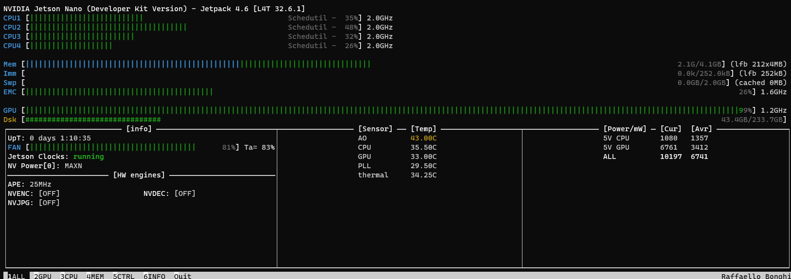
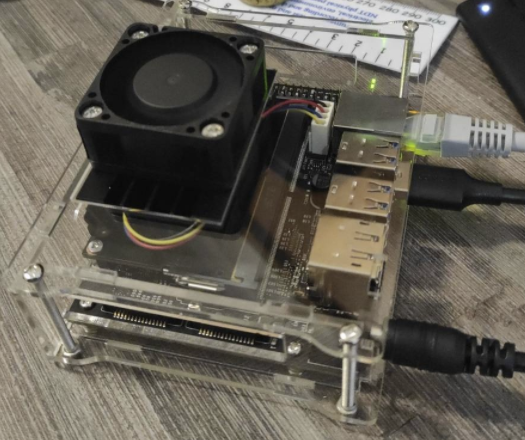
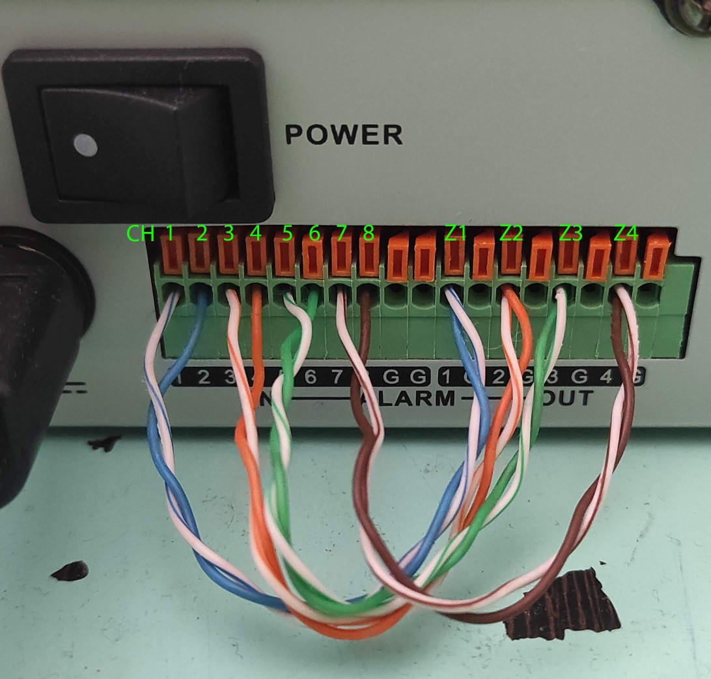
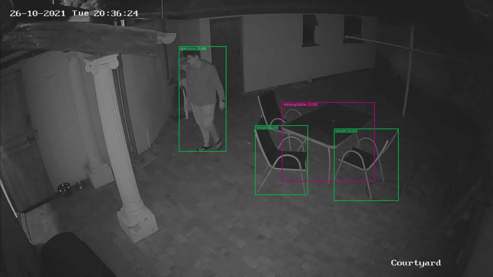
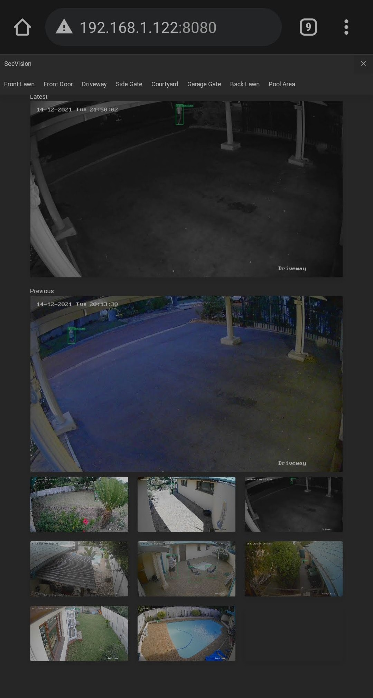

## NVIDIA Jetson - SecVision

Technologies used
  - Jetson Nano
  - TensorRT 
  - Darknet - Yolov4-416
  - HikVision DVR DS-7208HUHI-K2

### Prerequisites 

  - **PLEASE BUILD THIS PROJECT FIRST**
    - https://github.com/jkjung-avt/tensorrt_demos
    - Environment is ready when Demo #5 runs with yolov4-416 model
  - Running redis instance 
    - https://redis.io/topics/quickstart
    
### Goals

 - Use still frames from HTTP GET from DVR to analyze zones(cameras)
 - Detected persons
   - HTTP PUT to HikVision DVR
   - Use DVR output connected to input to trigger recording on DVR

## To Do 

  - [x] Make it not use AlarmIO to trigger events (zoneless operation)
  - [ ] Add surveillance center notifications
 ### Usage

   Setup settings.ini
    
    [DVR]
    username = dummy => user for DVR login
    password = SuchPass => password for DVR login
    channels = 8 => channels on DVR
    ip = 0.0.0.0 => IP address of DVR on local network
   
   On DVR set basic auth for HTTP request
   
    git clone https://github.com/Psynosaur/JetsonSecVision && cd JetsonSecVision
    pip3 install aiofiles aiohttp asyncio colorlog tinydb

   ### Project needs symlinks to tensorrt_demo project
   #### Setup environment

    cd detect_yolo 
    ln -s ${HOME}/tensorrt_demos/utils/ ./utils
    ln -s ${HOME}/tensorrt_demos/plugins/ ./plugins
    ln -s ${HOME}/tensorrt_demos/yolo/ ./yolo
    cd ..

   #### Run script with model of your choice built from the TensorRT demos instructions

     python3 detect_yolo/detect_yolo.py -m yolov4-416

   Takes approximately 2.4 seconds round trip to do its thing for 8x2MP images and is very accurate
   Detection step takes 1.68s for a network fps of **~4.57FPS**. 
   
   ### When the jetson is overclocked this is at around ~5.7FPS at 1.15GHz GPU and consumes ~14.5W at the wall.
    
   This routine is not very resource intensive as a video feed would be, nor would it be as unstable at these speeds.

   

   here it is doing its thing

   

   Channel and zone AlarmIO wiring

   

   ### Automatic / Continuous Operation
   
   ### Installation

    $ sudo detect_yolo/install_yolo.sh

   ### Check status of service

    $ sudo service detect_yolo status
     
   ### To stop the service, simply run:

    $ sudo service detect_yolo stop

   ### To uninstall the service

    $ sudo detect_yolo/uninstall_yolo.sh

### Developers

    $ sudo detect_yolo/refresh_yolo.sh

### Expected output 

    Oct 26 20:36:26 jetson secvision_yolo[26856]: INFO: 501 Person found - Zone 3 start recording
    Oct 26 20:36:26 jetson secvision_yolo[26856]: INFO: Zone 3 triggered on
    Oct 26 20:36:27 jetson secvision_yolo[26856]: INFO: Network 4.53fps
    Oct 26 20:36:29 jetson secvision_yolo[26856]: INFO: 501 Person found 2.737577s ago
    Oct 26 20:36:29 jetson secvision_yolo[26856]: INFO: CPU 32.50°C / GPU 31.50°C / PLL 28.00°C
    Oct 26 20:36:29 jetson secvision_yolo[26856]: INFO: AO 38.50°C / THERM 32.25°C / FAN 1195.0RPM
    Oct 26 20:36:30 jetson secvision_yolo[26856]: INFO: Network 4.58fps
    Oct 26 20:36:32 jetson secvision_yolo[26856]: INFO: Network 4.79fps
    Oct 26 20:36:34 jetson secvision_yolo[26856]: INFO: 501 Person found 8.268842s ago
    Oct 26 20:36:34 jetson secvision_yolo[26856]: INFO: CPU 34.00°C / GPU 30.50°C / PLL 28.00°C
    Oct 26 20:36:34 jetson secvision_yolo[26856]: INFO: AO 40.00°C / THERM 32.50°C / FAN 1312.0RPM
    Oct 26 20:36:34 jetson secvision_yolo[26856]: INFO: Network 4.60fps
    Oct 26 20:36:37 jetson secvision_yolo[26856]: INFO: Network 4.76fps
    Oct 26 20:36:39 jetson secvision_yolo[26856]: INFO: Network 4.78fps
    Oct 26 20:36:40 jetson secvision_yolo[26856]: INFO: 501 Person found 13.755617s ago
    Oct 26 20:36:40 jetson secvision_yolo[26856]: INFO: CPU 32.00°C / GPU 30.00°C / PLL 28.00°C
    Oct 26 20:36:40 jetson secvision_yolo[26856]: INFO: AO 36.50°C / THERM 32.00°C / FAN 1125.0RPM
    Oct 26 20:36:42 jetson secvision_yolo[26856]: INFO: Network 4.76fps
    Oct 26 20:36:44 jetson secvision_yolo[26856]: INFO: Network 4.79fps
    Oct 26 20:36:45 jetson secvision_yolo[26856]: INFO: 501 Person found 19.258132s ago
    Oct 26 20:36:45 jetson secvision_yolo[26856]: INFO: CPU 32.00°C / GPU 30.00°C / PLL 28.00°C
    Oct 26 20:36:45 jetson secvision_yolo[26856]: INFO: AO 35.50°C / THERM 31.00°C / FAN 1289.0RPM
    Oct 26 20:36:47 jetson secvision_yolo[26856]: INFO: Network 4.74fps
    Oct 26 20:36:49 jetson secvision_yolo[26856]: INFO: Network 4.76fps
    Oct 26 20:36:51 jetson secvision_yolo[26856]: INFO: 501 Person found 24.786598s ago
    Oct 26 20:36:51 jetson secvision_yolo[26856]: INFO: CPU 33.50°C / GPU 30.50°C / PLL 28.50°C
    Oct 26 20:36:51 jetson secvision_yolo[26856]: INFO: AO 40.00°C / THERM 32.50°C / FAN 1062.0RPM
    Oct 26 20:36:52 jetson secvision_yolo[26856]: INFO: Network 4.59fps
    Oct 26 20:36:54 jetson secvision_yolo[26856]: INFO: Network 4.78fps
    Oct 26 20:36:56 jetson secvision_yolo[26856]: INFO: 501 Person found 30.318584s ago
    Oct 26 20:36:56 jetson secvision_yolo[26856]: INFO: CPU 33.50°C / GPU 31.00°C / PLL 28.50°C
    Oct 26 20:36:56 jetson secvision_yolo[26856]: INFO: AO 40.00°C / THERM 33.25°C / FAN 1328.0RPM
    Oct 26 20:36:57 jetson secvision_yolo[26856]: INFO: Network 4.70fps
    Oct 26 20:36:57 jetson secvision_yolo[26856]: INFO: Zone 3 triggered off
    
 Dashboard available on jetson IP address on port **8080** 

     

