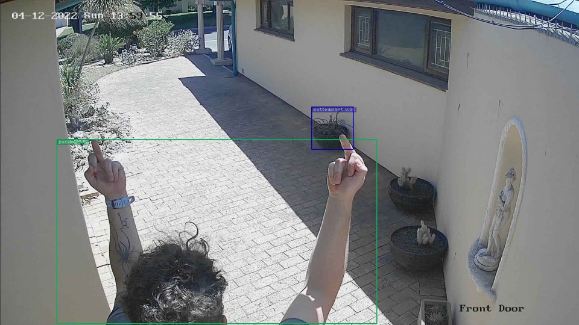

## NVIDIA Jetson - SecVision

Technologies used
  - Jetson Nano
  - TensorRT 
  - Darknet - Yolov4-416
  - HikVision DVR DS-7208HUHI-K2

### Prerequisites 

  - **PLEASE BUILD THIS PROJECT FIRST**
    - https://github.com/jkjung-avt/tensorrt_demos
    - Environment is ready when Demo #5 runs with yolov4-416 model
  - Running redis instance 
    - https://redis.io/topics/quickstart
  - Follow the instructions to set up a bot and get your user id
    - https://www.instructables.com/Set-up-Telegram-Bot-on-Raspberry-Pi/
    - Once the bot is set up send it a message on telegram
    - In your browser paste the following url
      - https://api.telegram.org/bot{token}/getUpdates 
      - Then get the id in the "from" object with your username in
      - Replace both **token** and **id** in the settings.ini file
    
### Goals

 - Use still frames from HTTP GET from DVR to analyze zones(cameras)
 - Detected persons
   - HTTP PUT to HikVision DVR
   - Use DVR output connected to input to trigger recording on DVR

## To Do 

  - [x] Make it not use AlarmIO to trigger events (zone less operation)
  - [x] Added telegram bot for sending pics of people at the front door
  - [ ] Add surveillance center notifications
  - [ ] Make Telegram notifications for all channels from settings and optional

 ### Usage

   Setup settings.ini
    
    [DVR]
    username = dummy => user for DVR login
    password = SuchPass => password for DVR login
    channels = 8 => channels on DVR
    ip = 0.0.0.0 => IP address of DVR on local network
    [Telegram]
    token = botapitoken => get this from the telegram BotFather
    id = userid => the id of your user chatting to the bot
   
   On DVR set basic auth for HTTP request
   
    git clone https://github.com/Psynosaur/JetsonSecVision && cd JetsonSecVision
    pip3 install aiofiles aiohttp asyncio colorlog redis

   ### Project needs symlinks to tensorrt_demo project
   #### Setup environment

    cd detect_yolo 
    ln -s ${HOME}/tensorrt demos/utils/ ./utils
    ln -s ${HOME}/tensorrt_demos/plugins/ ./plugins
    ln -s ${HOME}/tensorrt_demos/yolo/ ./yolo
    cd ..

   #### Run script with model of your choice built from the TensorRT demos instructions

     python3 detect_yolo/detect_yolo.py -m yolov4-416

   Takes approximately 2.4 seconds round trip to do its thing for 8x2MP images and is very accurate
   Detection step takes 1.68s for a network fps of **~4.57FPS**. 
   
   ### When the jetson is overclocked this is at around ~5.7FPS at 1.15GHz GPU and consumes ~14.5W at the wall.
    
   This routine is not very resource intensive as a video feed would be, nor would it be as unstable at these speeds.

   

   here it is doing its thing

   

   Channel and zone AlarmIO wiring

   

   ### Automatic / Continuous Operation
   
   ### Installation

    $ sudo detect_yolo/install_yolo.sh

   ### Check status of service

    $ sudo service detect_yolo status
     
   ### To stop the service, simply run:

    $ sudo service detect_yolo stop

   ### To uninstall the service

    $ sudo detect_yolo/uninstall_yolo.sh

### Developers

    $ sudo detect_yolo/refresh_yolo.sh

### Expected output 

    Dec 04 13:59:57 jetson secvision_yolo[19702]: INFO: GET DATA - 0.69s
    Dec 04 13:59:57 jetson secvision_yolo[19702]: WARNING: 201 started recording
    Dec 04 13:59:57 jetson secvision_yolo[19702]: WARNING: Front door - 0.88 - 1 person found in zone 1 - start recording
    Dec 04 13:59:57 jetson secvision_yolo[19702]: DEBUG:Using selector: EpollSelector
    Dec 04 13:59:58 jetson secvision_yolo[19702]: INFO: Main loop - 2.16s Inference loop - 1.47s @ 5.46fps
    Dec 04 13:59:59 jetson secvision_yolo[19702]: WARNING: Front door person found 1.288873s ago
    Dec 04 13:59:59 jetson secvision_yolo[19702]: WARNING: Sent telegram message via API and it took 1.348s
    Dec 04 13:59:59 jetson secvision_yolo[19702]: INFO: GET DATA - 0.70s
    Dec 04 13:59:59 jetson secvision_yolo[19702]: WARNING: Front door - 1.00 - 1 person found in zone 1 - recording
    Dec 04 13:59:59 jetson secvision_yolo[19702]: INFO:201 event exists
    Dec 04 14:00:01 jetson secvision_yolo[19702]: INFO: Main loop - 2.12s Inference loop - 1.42s @ 5.63fps
    Dec 04 14:00:01 jetson secvision_yolo[19702]: INFO: GET DATA - 0.76s
    Dec 04 14:00:03 jetson secvision_yolo[19702]: INFO: Main loop - 2.18s Inference loop - 1.42s @ 5.63fps
    Dec 04 14:00:03 jetson secvision_yolo[19702]: INFO: GET DATA - 0.72s
    Dec 04 14:00:04 jetson secvision_yolo[19702]: WARNING: Front door person found 4.141477s ago
    Dec 04 14:00:05 jetson secvision_yolo[19702]: INFO: Main loop - 2.13s Inference loop - 1.41s @ 5.66fps
    Dec 04 14:00:06 jetson secvision_yolo[19702]: INFO: GET DATA - 0.75s
    Dec 04 14:00:07 jetson secvision_yolo[19702]: INFO: Main loop - 2.17s Inference loop - 1.42s @ 5.64fps
    Dec 04 14:00:08 jetson secvision_yolo[19702]: INFO: GET DATA - 0.74s
    Dec 04 14:00:09 jetson secvision_yolo[19702]: INFO: Main loop - 2.18s Inference loop - 1.44s @ 5.57fps
    Dec 04 14:00:09 jetson secvision_yolo[19702]: INFO: CPU 40.00°C / GPU 36.50°C / PLL 33.50°C
    Dec 04 14:00:09 jetson secvision_yolo[19702]: INFO: AO 45.00°C / THERM 38.00°C / FAN 1625.0RPM
    Dec 04 14:00:09 jetson secvision_yolo[19702]: INFO: NETWORK 5.63 FPS
    Dec 04 14:00:09 jetson secvision_yolo[19702]: WARNING: Front door person found 9.743311s ago
    Dec 04 14:00:10 jetson secvision_yolo[19702]: INFO: GET DATA - 0.72s
    Dec 04 14:00:11 jetson secvision_yolo[19702]: INFO: Main loop - 2.14s Inference loop - 1.42s @ 5.64fps
    Dec 04 14:00:12 jetson secvision_yolo[19702]: INFO: GET DATA - 0.73s
    Dec 04 14:00:13 jetson secvision_yolo[19702]: INFO: Main loop - 2.14s Inference loop - 1.41s @ 5.67fps
    Dec 04 14:00:14 jetson secvision_yolo[19702]: WARNING: Front door person found 14.743941s ago
    Dec 04 14:00:14 jetson secvision_yolo[19702]: INFO: GET DATA - 0.76s
    Dec 04 14:00:16 jetson secvision_yolo[19702]: INFO: Main loop - 2.17s Inference loop - 1.41s @ 5.66fps
    Dec 04 14:00:16 jetson secvision_yolo[19702]: INFO: GET DATA - 0.67s
    Dec 04 14:00:18 jetson secvision_yolo[19702]: INFO: Main loop - 2.09s Inference loop - 1.42s @ 5.64fps
    Dec 04 14:00:18 jetson secvision_yolo[19702]: INFO: GET DATA - 0.71s
    Dec 04 14:00:19 jetson secvision_yolo[19702]: WARNING: Front door person found 19.744398s ago
    Dec 04 14:00:20 jetson secvision_yolo[19702]: INFO: Main loop - 2.13s Inference loop - 1.41s @ 5.66fps
    Dec 04 14:00:21 jetson secvision_yolo[19702]: INFO: GET DATA - 0.74s
    Dec 04 14:00:22 jetson secvision_yolo[19702]: INFO: Main loop - 2.15s Inference loop - 1.41s @ 5.68fps
    Dec 04 14:00:23 jetson secvision_yolo[19702]: INFO: GET DATA - 0.70s
    Dec 04 14:00:24 jetson secvision_yolo[19702]: INFO: Main loop - 2.11s Inference loop - 1.41s @ 5.67fps
    Dec 04 14:00:24 jetson secvision_yolo[19702]: WARNING: Front door person found 24.744972s ago
    Dec 04 14:00:25 jetson secvision_yolo[19702]: INFO: GET DATA - 0.79s
    Dec 04 14:00:26 jetson secvision_yolo[19702]: WARNING: 201 stopped recording
    Dec 04 14:00:26 jetson secvision_yolo[19702]: INFO: Main loop - 2.22s Inference loop - 1.41s @ 5.68fps
    Dec 04 14:00:27 jetson secvision_yolo[19702]: INFO: GET DATA - 0.76s
    Dec 04 14:00:29 jetson secvision_yolo[19702]: INFO: Main loop - 2.18s Inference loop - 1.42s @ 5.63fps
    Dec 04 14:00:29 jetson secvision_yolo[19702]: INFO: GET DATA - 0.73s
    
 Dashboard available on jetson IP address on port **8080** 

     

